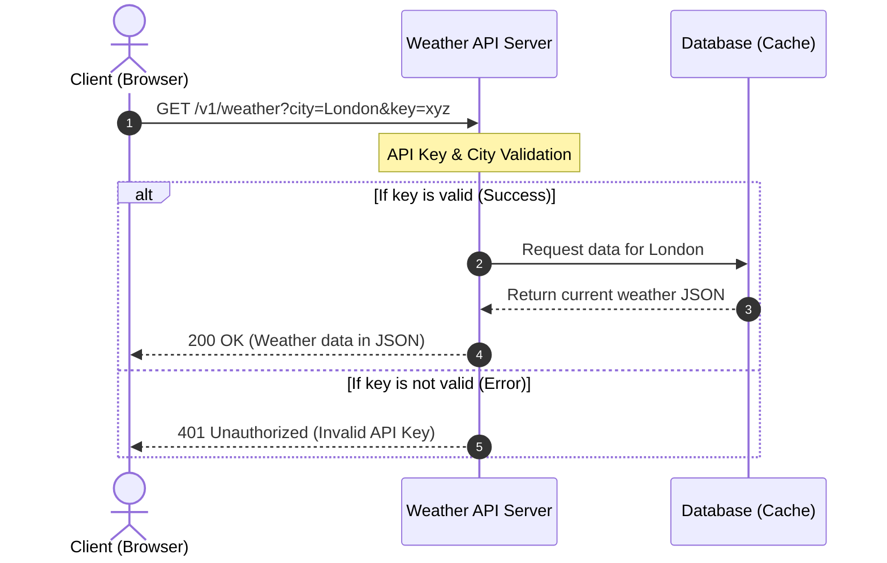

# Weather API Integration Guide

This guide explains how to integrate with the WeatherAPI service to retrieve real-time weather data using Python.

## Overview

The WeatherAPI allows developers to fetch current weather conditions by sending HTTP GET requests. The API responses are returned in **JSON** format.

### Base URL
```http
https://api.weatherapi.com/v1
```

---

## Authentication

To use the API, you must include your personal API key in the request URL as a query parameter named `key`.

**Example Request URL:**
```http
https://api.weatherapi.com/v1/current.json?key=YOUR_API_KEY&q=Paris
```

---

## Code Example (Python)

Below is a complete Python script using the `requests` library to fetch current weather data.

```python
import requests

def get_current_weather(api_key, city):
    url = "https://api.weatherapi.com/v1/current.json"
    params = {
        "key": api_key,
        "q": city,
        "aqi": "no"
    }
    
    try:
        response = requests.get(url, params=params)
        response.raise_for_status() 
        data = response.json()
        return data
        
    except requests.exceptions.HTTPError as error:
        print(f"HTTP Error occurred: {error}")
        return None

# Usage example:
# weather_data = get_current_weather("your_key_here", "London")
```

---

## Response Structure

A successful request returns an `HTTP 200 OK` status code and a JSON object. Here is an example of the response body and its field definitions.

### JSON Response Example
```json
{
  "location": {
    "name": "London",
    "country": "United Kingdom"
  },
  "current": {
    "temp_c": 15.0,
    "condition": {
      "text": "Partly cloudy"
    },
    "wind_kph": 11.2
  }
}
```

### Field Definitions

| Field Path | Type | Description | Example |
| :--- | :--- | :--- | :--- |
| `location.name` | String | The name of the requested city or location. | `"London"` |
| `location.country` | String | The country where the location is situated. | `"United Kingdom"` |
| `current.temp_c` | Float | Current temperature in Celsius. | `15.0` |
| `current.condition.text` | String | Weather condition text description. | `"Partly cloudy"` |
| `current.wind_kph` | Float | Wind speed measured in kilometers per hour. | `11.2` |
`